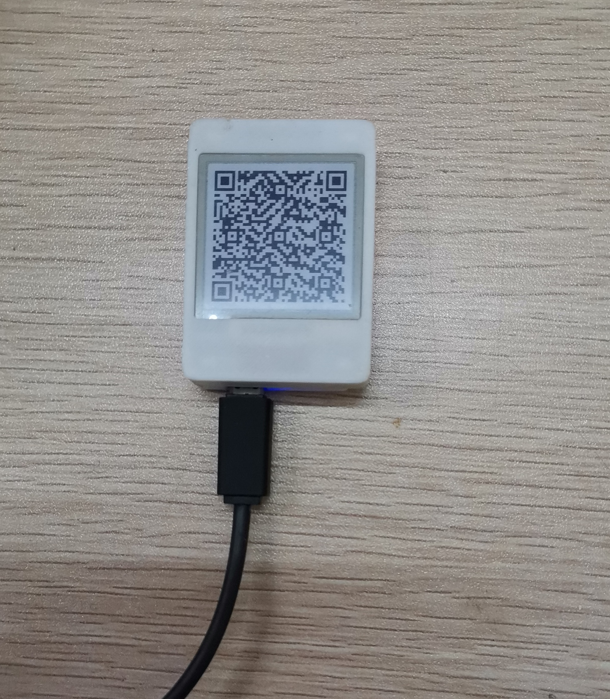

# EPD

基于 ESP32 和 1.54 英寸电子墨水屏的 Web 画板。

浏览器通过 WebSocket 向 ESP32 发送 200 × 200 黑白位图，设备收到后刷新墨水屏。ESP32 会优先连接指定 Wi-Fi，失败时自动创建 AP 热点，并在屏幕上显示访问地址二维码。



## 硬件

- ESP32 Dev Module
- Good Display GDEP015OC1
- 1.54 英寸黑白屏，200 × 200，IL3829

| 屏幕信号 | ESP32 |
|---|---:|
| CS | `SS` |
| DC | GPIO 17 |
| RST | 未连接（`-1`） |
| BUSY | 未连接（`-1`） |
| CLK | 默认 SPI SCK |
| DIN | 默认 SPI MOSI |

## 配置

在 [`src/main.cpp`](src/main.cpp) 中修改 Wi-Fi：

```cpp
constexpr char kWifiSsid[] = "hacker";
constexpr char kWifiPassword[] = "12345678";
```

连接超时后，设备会使用同一组名称和密码创建热点。

## 构建

项目使用 PlatformIO。固件和 SPIFFS 网页资源需要分别烧录：

```bash
pio run
pio run -t buildfs
pio run -t upload
pio run -t uploadfs
pio device monitor
```

串口监视器波特率为 115200。烧录完成后，扫描屏幕上的二维码即可打开画板。

## 工作原理

```text
Web 画板 ── WebSocket :81 ── ESP32 ── GxEPD2 ── GDEP015OC1
                │
                └── 200 × 200 ÷ 8 = 5000 bytes
```

HTTP 服务运行在 80 端口。每张图先经过 7 次局部刷新，第 8 次执行全刷，以减少残影。

## 2026 兼容性更新

项目最初创建于 2020 年，本次更新主要包括：

- Espressif32 平台升级至 7.1.1
- ESPAsyncWebServer 升级至 3.12.0
- Adafruit GFX 升级至 1.12.6
- GxEPD 迁移至 GxEPD2 1.6.9
- 修复新版库 API 和依赖解析兼容问题
- 重构 Wi-Fi、WebSocket 和屏幕刷新逻辑
- 更新画板页面，移除 CDN 依赖并增加断线重连

## 说明

- GDEP015OC1 已停产，同尺寸替代屏不一定兼容 `GxEPD2_154` 驱动。
- WebSocket 没有加密或鉴权，请仅在可信局域网中使用。
- `data/www/new_index.html` 和 `src/others.x` 是未启用的旧实验代码。
